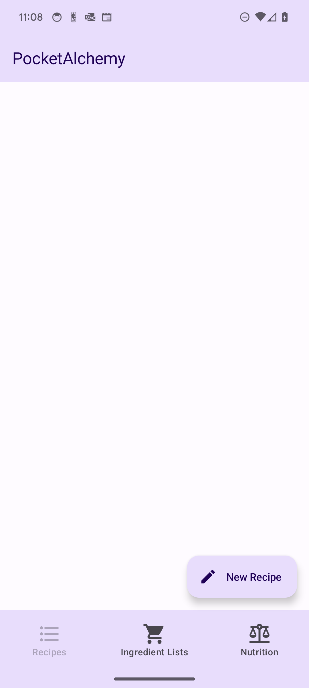

# PocketAlchemy
---
### *WORK IN PROGRESS*
#### *version: 1.0-alpha* 

  Built with the home cook in mind. PocketAlchemy is a recipe book application for Android built with Kotlin and AndroidStudio. 
Create, save, and organize recipes. Create shopping lists and count calories for your recipes with PocketAlchemy. This is a work in progress currently in early stages of development.

---
## SCREENSHOTS

---

## DOCUMENTATION
#### v0.1.alpha
- [Product Overview](doc/v0.1.alpha/product_overview/product_overview.pdf)
- [Features List](doc/v0.1.alpha/features_list/features_list.pdf)
- [Version Dependencies](doc/v0.1.alpha/version_dependencies/version_dependencies.pdf)
- [Version Notes](doc/v0.1.alpha/version_notes/version_notes.pdf)

#### v0.0.alpha
- [Product Overview](doc/v0.0.alpha/product_overview/product_overview.pdf)
- [Features List](doc/v0.0.alpha/features_list/features_list.pdf)
- [Version Dependencies](doc/v0.0.alpha/version_dependencies/version_dependencies.pdf)
- [Version Notes](doc/v0.0.alpha/version_notes/version_notes.pdf)

---

#### Contact
Cody Weaver \<Cody.Weaver@colorado.edu>

---
